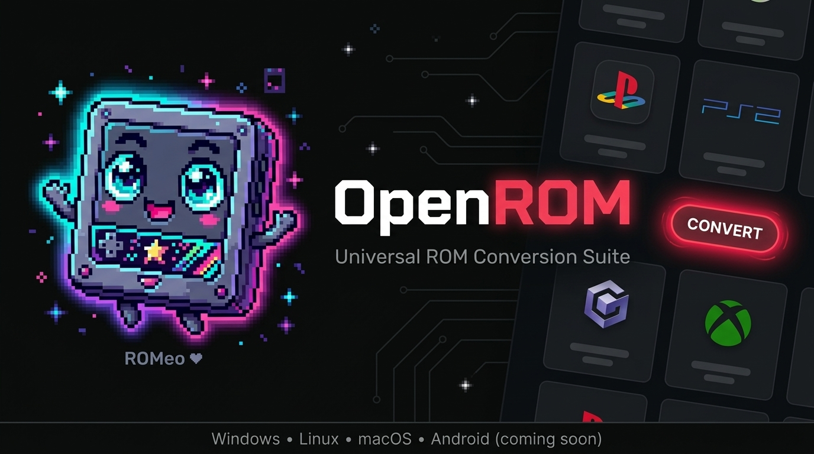

<p align="center">
  
</p>

<h1 align="center">⬡ OpenROM</h1>
<p align="center"><b>Universal ROM Conversion Suite</b> — by M5 Dev</p>

<p align="center">
  <a href="LICENSE"></a>
  <a href="https://sourceforge.net/projects/openrom/files/latest/download"></a>
  
  <a href="https://github.com/M5Devs/OpenROM/releases/latest"></a>
  <a href="https://github.com/M5Devs/OpenROM/releases/latest"></a>
  <a href="https://sourceforge.net/projects/openrom/files/latest/download"></a>
</p>

---

> 🎮 Meet **ROMeo** — OpenROM's official mascot. Your friendly pixel-art cartridge companion for all things ROM.

OpenROM is a free, open-source Universal ROM Conversion Suite built to replace every proprietary and fragmented ROM tool out there. Powered by a modern **Flutter desktop UI** with a gaming dashboard aesthetic, real-time terminal logging, batch processing, smart platform detection, and a full headless CLI for automation — all running **100% offline**.

---

## ⬇️ Download

| Platform | GitHub Release | SourceForge Mirror |
|----------|---------------|-------------------|
| 🪟 Windows | [OpenROM_Windows_Portable.zip](https://github.com/M5Devs/OpenROM/releases/latest) | [Mirror](https://sourceforge.net/projects/openrom/files/latest/download) |
| 🐧 Linux | [OpenROM_Linux_x86_64.zip](https://github.com/M5Devs/OpenROM/releases/latest) | [Mirror](https://sourceforge.net/projects/openrom/files/latest/download) |
| 🍎 macOS Apple Silicon | [OpenROM_macOS_arm64.zip](https://github.com/M5Devs/OpenROM/releases/latest) | [Mirror](https://sourceforge.net/projects/openrom/files/latest/download) |
| 🍎 macOS Intel | [OpenROM_macOS_x86_64.zip](https://github.com/M5Devs/OpenROM/releases/latest) | [Mirror](https://sourceforge.net/projects/openrom/files/latest/download) |
| 🤖 Android | 🚧 Coming soon via Termux | — |

Each release includes the **Flutter GUI** (`OpenROM`) and the **headless CLI** (`openrom-core`).

📖 **Guides & Docs:** [Official Wiki](https://github.com/M5Devs/OpenROM/wiki) — setup, Steam Deck, Termux, FAQs.

---

## 🎮 Features

- **Gaming Dashboard UI** — Flutter-powered dark interface inspired by PS5/Xbox aesthetics, with ROM cards, platform badges, and real-time progress.
- **Themeable** — Swap between built-in themes (Gaming Dashboard, Cyberpunk, Terminal, Minimal) or create your own via JSON.
- **Complete Conversion Matrix** — 20+ conversion paths: ISO, BIN, CUE, GDI, IMG, ECM, CHD, CSO, ZSO, XISO, RVZ, WIA, WBFS, GCZ.
- **Smart Platform Detection** — Magic byte detection for PS1, PS2, PSP, Xbox, GameCube, Wii, Dreamcast — not size guessing.
- **Real CHD Header Parsing** — Reads actual CHD v4/v5 headers to determine CD vs DVD type accurately.
- **Auto CUE Generation** — Generates CUE sheets for standalone BIN files with correct track mode (MODE1/MODE2/AUDIO).
- **Integrity Verification** — Post-conversion CHD integrity check via `chdman verify`.
- **Batch Processing** — Drop a whole folder, convert everything at once.
- **Real-time Terminal Log** — Live process output with timestamps, slides up during conversion.
- **Drag & Drop** — Native drag and drop for files and folders.
- **Full Headless CLI** — `openrom-core` for scripting, automation, and Flutter IPC.
- **No Telemetry** — Zero network requests. No analytics. Runs 100% locally forever.

---

## 🔁 Conversion Matrix

| Input | Output | Tool | Notes |
|-------|--------|------|-------|
| ISO | CHD | chdman | `createcd` for PS1, `createdvd` for PS2/GC |
| ISO | CSO | maxcso | PSP / PS2 |
| ISO | ECM | ecm | |
| ISO | XISO | extract-xiso | Xbox |
| ISO | RVZ | nodtool | GameCube / Wii |
| BIN | CHD | chdman | Auto CUE if missing |
| BIN | ECM | ecm | |
| CUE | CHD | chdman | |
| GDI | CHD | chdman | Dreamcast |
| IMG | CHD | chdman | |
| CHD | ISO | chdman | |
| CHD | BIN/CUE | chdman | |
| CSO | ISO | maxcso | |
| ZSO | ISO | maxcso | |
| ECM | ISO / BIN | unecm | Auto-detects output format |
| XISO | Files | extract-xiso | Extracts to folder |
| RVZ | ISO | nodtool | GameCube / Wii |
| WIA | ISO | nodtool | GameCube / Wii |
| WBFS | ISO | nodtool | Wii |
| GCZ | ISO | nodtool | GameCube / Wii |

---

## 💻 CLI Usage

```bash
# Detect file format and platform
openrom-core --detect game.iso

# Convert a single file
openrom-core --input game.iso --format CHD

# Batch convert a folder
openrom-core --folder /roms/ --format CHD --compression Max

# Convert with verification
openrom-core --input game.iso --format CHD --verify

# Verify a CHD
openrom-core --input game.chd --verify-only

# List supported formats
openrom-core --list-formats

# JSON output (for scripting / Flutter IPC)
openrom-core --json --detect game.iso
```

---

## 🎨 Themes

OpenROM ships with 4 built-in themes and supports fully custom themes via JSON files in the `themes/` folder:

| Theme | Description |
|-------|-------------|
| `default.json` | Gaming Dashboard — dark navy, red accent |
| `cyberpunk.json` | Neon on black |
| `terminal.json` | Green on black, monospace |
| `minimal.json` | Clean light mode |

Create your own theme by copying any JSON file and editing the color values.

---

## 🛠️ Bundled Tools

All tools are open source and verifiable. See [SECURITY.md](SECURITY.md) for SHA256 checksums.

| Tool | Purpose | License |
|------|---------|---------|
| **chdman** | CHD conversion (MAME) | GPL v2 |
| **maxcso** | CSO/ZSO compression | ISC |
| **ecm / unecm** | ECM compression | GPL v2 |
| **extract-xiso** | Xbox ISO extraction | GPL v2 |
| **nodtool** | GameCube / Wii formats | MIT |

---

## 🚀 Building from Source

### Requirements
- Python 3.10+
- Flutter 3.27+
- PyInstaller 6.0+

### Run Flutter UI from source
```bash
git clone https://github.com/M5Devs/OpenROM
cd OpenROM

# Build headless Python core
pip install -r requirements.txt
pyinstaller --onefile --name openrom-core core/cli.py

# Run Flutter UI
cd openrom_flutter
flutter pub get
flutter run -d windows   # or linux / macos
```

### Build release packages
```bash
# Windows
build_windows.bat

# Linux
./build_linux.sh

# macOS
./build_mac.sh
```

---

## 🗺️ Roadmap

- [x] Flutter UI rewrite (v2.5.0)
- [x] Magic byte platform detection
- [x] CHD header parsing
- [x] Theme system
- [ ] Android support via Termux 🤖
- [ ] ROM Checker — No-Intro DAT + RetroAchievements hash verification
- [ ] ARM builds (Linux ARM64)

---

## 🤝 Contributing

Contributions are welcome! Read [CONTRIBUTING.md](CONTRIBUTING.md) for guidelines on bug reports, feature requests, and pull requests.

---

## 📄 License

OpenROM is licensed under **GPL v3 + Commons Clause**.

| | |
|---|---|
| ✅ | Free to use personally |
| ✅ | Free to study, modify, and contribute |
| ✅ | Forks must remain open source |
| ❌ | Cannot be sold or bundled commercially without permission |

Commercial licensing: open a discussion on GitHub or reach out on [Twitter/X @M5Devs](https://x.com/M5Devs)
